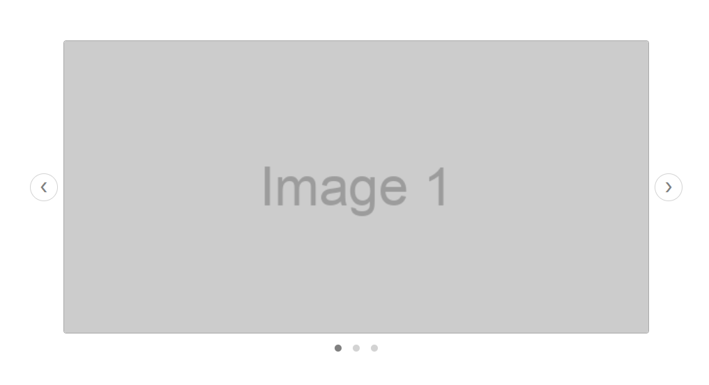

# Live Coding Challenge: Image Carousel Web Component

## Description

The goal of this challenge is to build a reusable **Image Carousel** web component using the **Lit** library. The carousel should display a series of images, allowing both **manual** and **automatic transitions**, and can be easily reusable across different applications. The component must be responsive.

## Expected Structure and Styling (spec)

The **Image Carousel** should follow a structured layout to organize the images, navigation buttons, and slide indicators (dots). Below is the basic structure and an accompanying image that reflects the expected design:


## Objective

Build an image carousel component that meets the following requirements:

### Key Features:
- **Responsive design** - Ensuring the component adjusts to different screen sizes and its parent container.
- **Manual navigation** - Via the arrow buttons (e.g. next/previous).
- **Slide Indicators** - Each dot corresponds to an image in the carousel. The number of dots equals the number of images in the carousel, and their position visually indicates which image is currently being displayed
- **Automatic transitions** between slides, with the ability to stop on hover.
- **Configurable options**:
    - Ability to update the images at runtime.
    - Ability to control whether it will navigate in `autoPlay` mode.
    - Ability to pass a custom interval for automatic transitions (default is 5 seconds).


## Bonus Points (Optional)
- Ensure the component is easily styled using **CSS custom properties** (e.g. `carousel-button-size`).

## Steps

1. **Set up the Project**:
   - Explore the `package.json` file to understand how to run the project.

2. **Create Component's Structure**:
   - Define the HTML structure of the image carousel.

3. **Responsive Design and Styling**:
   - Style the image carousel according to spec (see image).
   - Ensure the image carousel is responsive and adapts to different screen sizes and its parent container.

4. **Manual Navigation**:
   - Implement left/right navigation functionality using the arrow buttons.

5. **Automatic transitions**:
    - Implement `autoPlay` for automatic navigation between images, with a configurable interval.

6. **Implement Bonus Points**:
   - Allow external styles to override default styles via CSS.


## Example Usage

```html
    <image-carousel
        images='["https://via.placeholder.com/600x300?text=Image+1", "https://via.placeholder.com/600x300?text=Image+2"]'
        auto-play
        interval="5000">
    </image-carousel>
```
